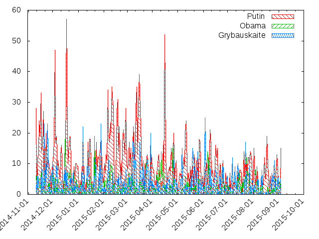

putinometras.lt
===============

putinometras.lt - Lietuvos interneto žiniasklados antraščių putinometras

2014-11-11 - 2015-09-04 veikęs interneto žiniasklados antraščių monitoringo ir analizės projektas.

Duomenys (220961 antraštės iš 5 populiariausių žinių portalų pagal http://www.audience.lt):
* [headlines.db](headlines.db) - SQLite db
* [headlines.csv](headlines.csv) - CSV

## Rezultatai
 
### Putinas:

### Kontrolinė grupė:

First Header  | Second Header
------------- | -------------
Content Cell  | Content Cell

Viso   | Putinas | % | Obama | % | Grybauskaitė | % 
------ | ------- | - | ----- | - | ------------ | - 
220961 | 3010    | 1 | 726   | 0 | 1153         | 1 

### Rusija:

